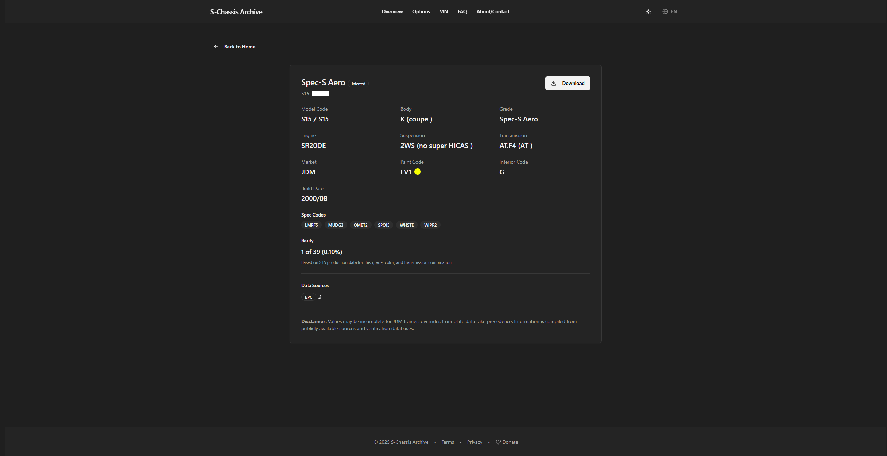
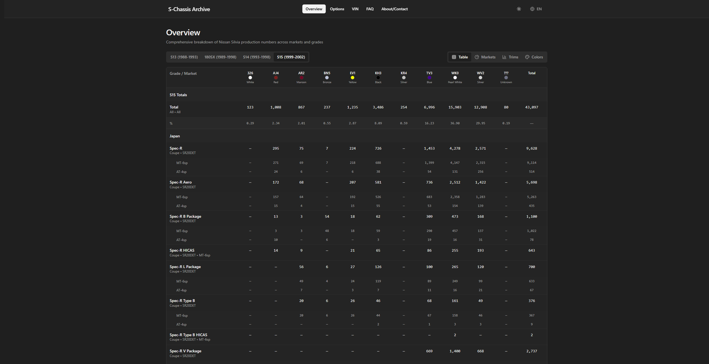
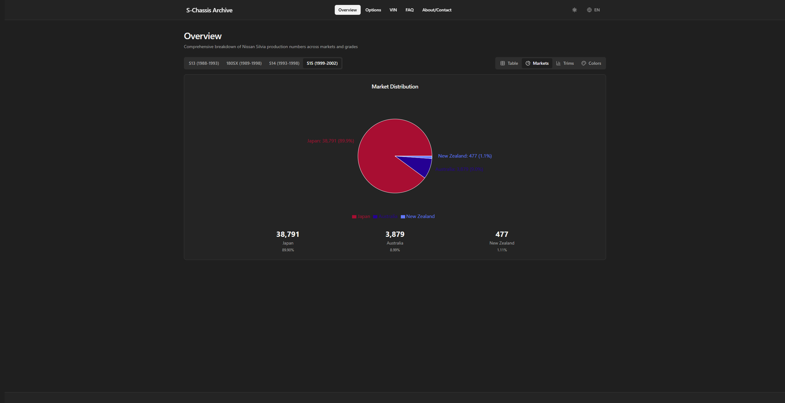
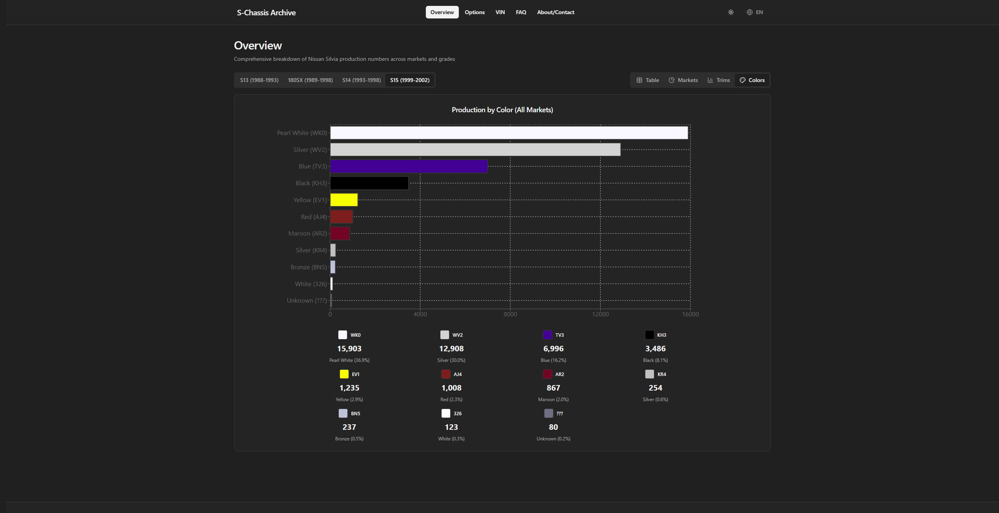

# S-Chassis Archive — Nissan S13/S14/S15 VIN Decoder & Production Intelligence
Live site: https://s-chassis-archive.com/

S-Chassis Archive is a community-first platform for decoding Nissan S-chassis VIN/frame numbers and exploring factory production data across markets, grades, options, and colourways. The mission is to preserve rare OEM knowledge and make it accessible for owners, builders, collectors, and researchers.

---

## Why I Built This
The S-chassis community has historically depended on a handful of legacy registry sites such as gtr-registry to decode chassis numbers and verify factory specs. When those registries went offline or became unreliable, essential OEM information effectively disappeared overnight.

I built S-Chassis Archive to:
- keep VIN decoding and production rarity data accessible long-term  
- provide a modern, fast alternative to older tools  
- preserve historically rare factory information for future owners and restorers  
- centralize scattered EPC/option/paint knowledge into one reliable archive

---

## What the Site Does
- **VIN / Frame Decoder (S13, S14, S15)**  
  Converts Nissan frame numbers into factory specs such as model type, drivetrain, engine, trim/grade, build period, and market.

- **Production Data Explorer**  
  Browse production counts by grade, market, options, and factory paint colour — with rarity context.

- **Options & Rarity Context**  
  Helps owners confirm authenticity and understand where their car sits relative to total production.

- **Reference Library**  
  Clear documentation on chassis formats, option codes, colour codes, and interpretation.

---

## Data & Methodology (High-Level)
To build accurate production and option tables, I developed a repeatable data pipeline:

1. **Collected OEM EPC/catalog records and Nissan code tables**  
2. **Parsed model / option / colour metadata using Python**  
3. **Normalized & reconciled codes across years and markets**  
4. **Aggregated production counts by grade, option, and colourway**  
5. **Exported structured CSV/JSON datasets consumed by the website**

**Note:** The full codebase and raw datasets are private to protect sources and prevent misuse. This repository is a public engineering + product case study.

---

## Tech Stack
**Frontend**
- Vite + React + TypeScript  
- Tailwind CSS  
- shadcn/ui (Radix UI) for component system  
- React Router for navigation  
- Recharts for production analytics  
- Zod for runtime validation  
- lucide-react icons  

**Backend / Data**
- Supabase (Postgres database, auth, storage)  
- Supabase Edge Functions (Deno/TypeScript) for VIN decoding and rate-limiting  

**Hosting**
- Porkbun (domain + hosting/DNS for deployment)

**Dev Tooling**
- ESLint + TypeScript ESLint  
- PostCSS + Autoprefixer  
- Vite React SWC plugin  

---

## Validation & Accuracy
- Cross-checked decoded fields against OEM code standards and community references  
- Spot-verified random samples across years/grades  
- Ran internal consistency checks (option compatibility, colour-year validity, market-trim rules)

Known limitations and ongoing fixes are tracked in `docs/validation-notes.md`.

---

## Impact
- Restores access to production intelligence that was previously fragmented or offline  
- Helps owners verify authenticity, spec, and rarity  
- Preserves S-chassis history in a modern, searchable archive

---

## Screenshots

### VIN / Frame Decoder
Shows an example decode flow from input to factory-spec output.  

### Production Overview
High-level production totals and breakdown context.  

### Market Breakdown Table
Production counts split by market/region.  

### Colourway / Paint Breakdown
Factory colour production counts and rarity context.  

---

## Roadmap
- Expand coverage for special editions and region-specific trims  
- Add deeper EPC part-number linkage per decoded car  
- Improve community contribution workflow + data review  
- More visual analytics for production trends

---

## Contributing / Feedback
This is a public documentation repo.  
If you spot a decode error or have verifiable OEM evidence:
- Open an issue with the frame/VIN and supporting references.

---

## Contact
**Lachlan Lunny**  
- Site: https://s-chassis-archive.com/  
- GitHub: https://github.com/llunny  
- Email: [contact@s-chassis-archive.com]

---

## Acknowledgements
Respect to the Nissan enthusiast community and the long-standing registry projects that inspired this archive.
